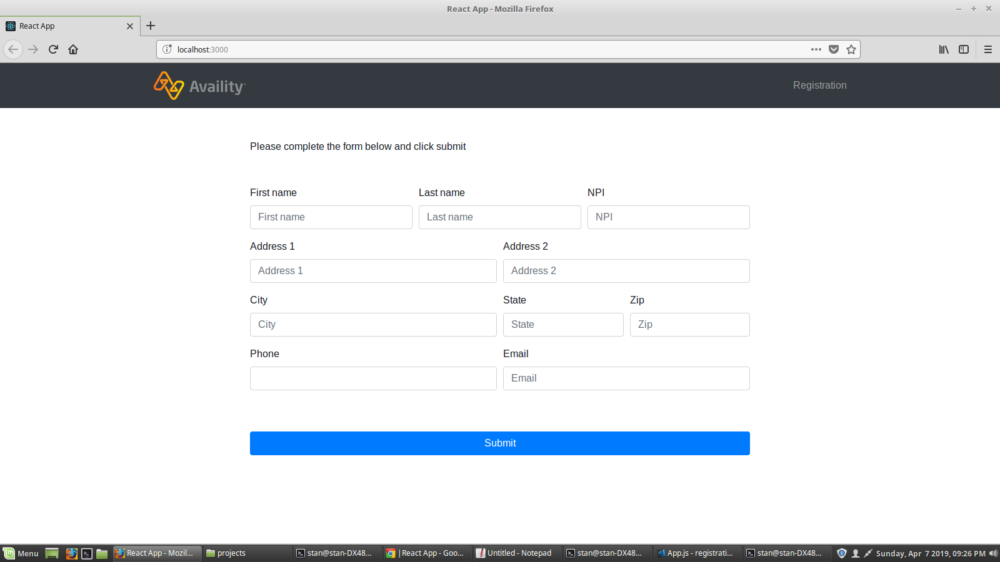

## How to Use

*You will need to create a config.js file in the root after you clone the repo, and add your own credentials:

<code>module.exports = {
    dbUser: 'YOUR_MONGODB_USERNAME',
    dbPass: 'YOUR_MONGODB_PASSWORD'
}</code>

In terminal:

<code>git clone https://github.com/schvetsov/registration-ui.git</code> 
<code>cd registration-ui</code> 
<code>npm install</code> 
<code>cd client</code> 
<code>npm install</code> 
<code>npm start</code> 
<code>cd ..</code> 
<code>node index.js</code> 

## You Should See This

